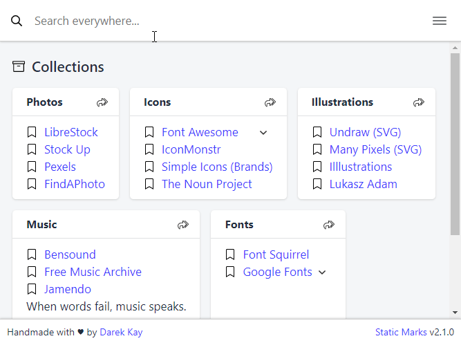

# Static Marks

<div align="center" class="text-center">

Convert your **plain bookmark** files into a **static web app**.


</div>

- **Share** your bookmarks app via a single self-contained HTML file.
- Use with **any modern browser**.
- **Import** bookmarks from Chrome, Firefox or Pocket.
- It's **free** and [open source](https://github.com/darekkay/static-marks).

🔖 [**View Live Demo**](https://darekkay.com/static-marks/demo/default.html)

## Demo

<div align="center" class="text-center">



</div>

## Features

- Use custom browser search engines with a `?search=%s` URL param ([example](https://darekkay.com/static-marks/demo/default.html?search=fire)).
  - In Firefox, right-click the Static Marks search field and select "Add a Keyword for this Search".
- Use custom web page templates. If you don't like the default UI, provide your own ([example](https://darekkay.com/static-marks/demo/custom.html) based on [this template](https://github.com/darekkay/static-marks/blob/master/docs/examples/templates/custom.html)).
- Dark Mode.

## Quickstart

- [Install](#installation) Static Marks:

```shell
npm install -g static-marks
```

- Create a plain text `bookmarks.yml` [YAML file](#file-format) containing your bookmarks. Alternatively, [import](#import-bookmarks) your existing browser bookmarks:

```shell
static-marks import browser-bookmarks.html > bookmarks.yml
```

- [Build](#build-bookmarks-app) your bookmarks app:

```shell
static-marks build bookmarks.yml > bookmarks.html
```

- Open `bookmarks.html` in your browser.

## Installation

This tool requires Node.js version 12+.

- As a globally available CLI tool:

```bash
npm install -g static-marks
```

- As a local dependency in your project:

```bash
npm install --save static-marks
```

- Without installing:

```shell
npx static-marks <command>
```

- As a [docker container](https://github.com/gaerfield/static-marks-docker) (unofficial).

## Usage

```
static-marks [options] <command>

Options:
  -V, --version               output the version number
  -h, --help                  output usage information

Commands:
  build [options] <files...>  build bookmarks app
  import [options] <file>     import bookmarks from chrome, firefox or pocket
  report <files...>           report bookmarks
```

Run `static-marks <command> --help` to view the usage of a specific command.

### Build bookmarks app

```
static-marks build [options] <files...>

Options:
  -o, --output [file]     output to a file (use stdout by default)
  -t, --title [title]     set document title
  --template-file [file]  use a custom web page template
```

Examples:

```bash
static-marks build bookmarks.yml > bookmarks.html  # Single file
static-marks build -o bookmarks.html bookmark.yml  # Alt. notation
static-marks build f1.yml f2.yml > bookmarks.html  # Multiple files
static-marks build files/* > bookmarks.html        # All files at path
```

### Import bookmarks

```
static-marks import [options] <file>

Options:
  -o, --output [file]  output to a file (use stdout by default)
```

Examples:

```bash
static-marks import exported.html > imported.yml
```

### View a report for your bookmarks

Currently, the report contains only the total bookmarks count. In the future, it might be used for detecting duplicate and dead links.

```bash
static-marks report [options] <files...>
```

Examples:

```bash
static-marks report bookmarks.yml
static-marks report files/*
```

## File format

Bookmark files are written in [YAML](http://yaml.org). There are multiple levels of hierarchy:

```yaml
Collection:
  - Bucket:
      - Link: https://example.com
```

A link URL can be expressed either as an item property or as a child item:

```yaml
- Link 1: https://example.com
- Link 2:
    - https://example.com
```

Notes and nested links are added as children of a link (the first element is the link URL). If the text is a valid-formatted URL it will be automatically converted to a link:

```yaml
- Link with notes:
    - https://example.com
    - This is a text note
    - Link note: https://example.com
    - https://example.net
```

First-level notes can be used to describe or structure a bucket:

```yaml
- Bucket:
    - Link 1: https://example.com
    - Carpe diem!
```

Here's a complete example:

```yaml
Collection:
  - Bucket:
      - Link 1: https://example.com
      - Link 2:
          - https://example.com
      - Link with notes:
          - https://example.com
          - This is a text note
          - Link note: https://example.com
      - First-level note
```

There is an optional 1st level hierarchy level available when you provide more than one bookmark file to `static-marks`. When passing multiple files, a header menu will be displayed to toggle between individual files and all bookmarks.

```bash
# file toggle menu not necessary/not available
static-marks build file1.yaml

# file toggle menu available
static-marks build file1.yaml file2.yaml
```
